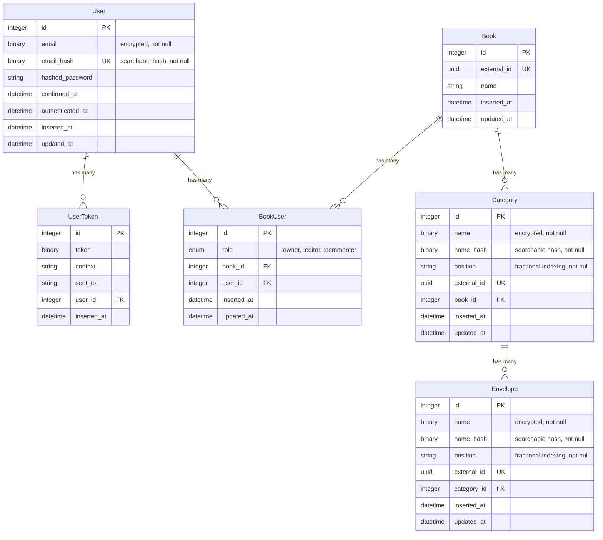

# PurseCraft Database Schema

## Entity-Relationship Diagram

## Table Descriptions

### Identity Context

#### User

The central entity for authentication and user management. Stores essential user information with encrypted email storage and hashed password. The system uses a confirmation mechanism for email verification.

**Encryption**: Email addresses are stored using a dual-column approach:
- `email`: AES-GCM encrypted binary field for secure storage
- `email_hash`: HMAC-SHA256 hash for searchable indexing and case-insensitive lookups

#### UserToken

Manages authentication tokens for various purposes like session management, login links, and email change confirmations. Each token has a specific context and validity period:
- Magic link tokens: 15 minutes
- Change email tokens: 7 days
- Session tokens: 60 days

### Budgeting Context

#### Book

Represents a user's budget - the top-level container in the budgeting system. A user can have multiple books, and books can be shared between users with different permission levels.

#### BookUser

Junction table that establishes a many-to-many relationship between users and books. Implements role-based access control with three levels:
- **owner**: Highest privilege level
- **editor**: Mid-level privileges
- **commenter**: Lowest privilege level

#### Category

Groups related envelopes together within a book. Categories help organize the budget structure and provide a logical separation of budget items.

**Encryption**: Category names use the same dual-column encryption pattern as user emails:
- `name`: AES-GCM encrypted binary field for secure storage
- `name_hash`: HMAC-SHA256 hash for searchable indexing
- **Security rationale**: Category names can reveal sensitive personal information (health conditions, personal struggles, family situations)

**Positioning**: Uses fractional indexing for efficient drag-and-drop reordering without updating all records.

#### Envelope

Represents a specific budget allocation within a category. Envelopes are the basic units of budget management in the envelope budgeting system.

**Encryption**: Envelope names use the same dual-column encryption pattern:
- `name`: AES-GCM encrypted binary field for secure storage
- `name_hash`: HMAC-SHA256 hash for searchable indexing
- **Security rationale**: Envelope names can reveal highly sensitive personal information (private habits, financial struggles, personal circumstances)

**Positioning**: Uses fractional indexing for efficient drag-and-drop reordering within categories.
